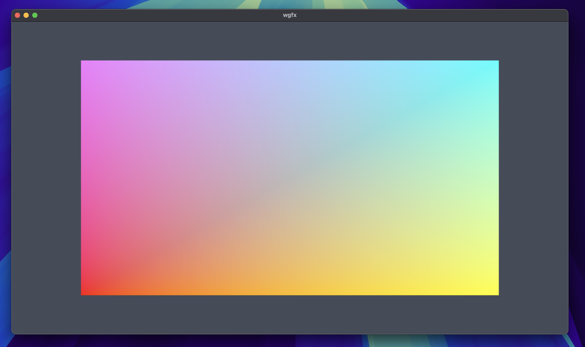
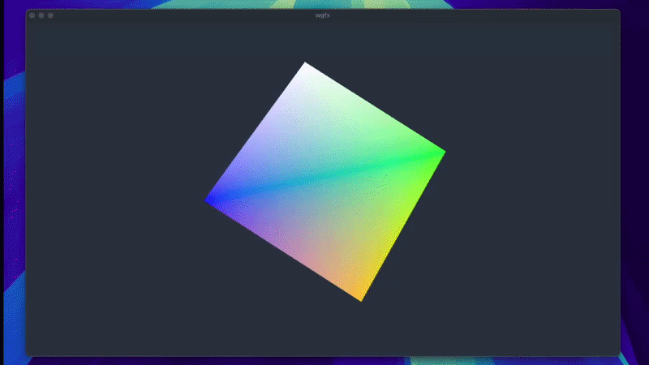

# wgfx


wgfx is a lightweight C++ WebGPU graphics framework focused on practical rendering and compute workflows.

This branch holds the library (`src/`), its WebGPU dependency (`deps/webgpu`), the optional SDL-to-WebGPU bridge, and CMake wiring. Runnable C++ samples are maintained on the **`examples`** branch so the default clone stays small.

## Screenshots






## Examples branch

```bash
git fetch origin examples
git checkout examples
```

There you will find the runnable sample applications and their assets.

## Build

```bash
cmake -S . -B build
cmake --build build
```

On this branch the configure step builds only the core `wgfx` library and WebGPU dependency by default.

## License

This project is licensed under the GNU Affero General Public License v3.0.
See LICENSE for details.
